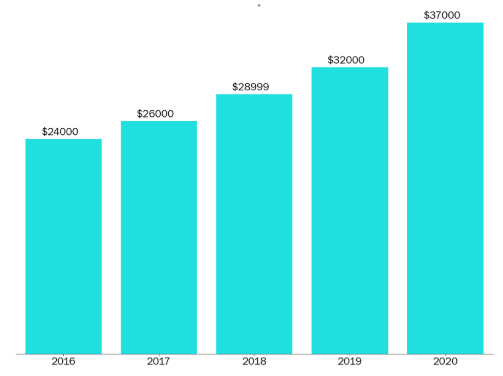
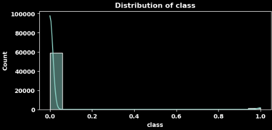
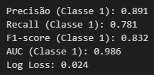

# Truck Air System Project

---

# 1. Business Problem

Uma nova empresa de consultoria em ciência de dados foi contratada para solucionar e aprimorar o planejamento de manutenção de uma empresa terceirizada de transporte. A empresa mantém um número médio de caminhões em sua frota para fazer entregas em todo o país. Porém, nos últimos 3 anos vem percebendo um grande aumento nos gastos relacionados à manutenção do sistema de ar de seus veículos, mesmo com o tamanho da sua frota relativamente constante ao longo do período. O custo de manutenção deste sistema específico é mostrado abaixo em dólares:

Neste sentido, o trabalho do cientista de dados é criar um modelo preditivo na tentativa de diminuir o custo anual para 2022. Esses custos são gerados devido aos seguintes critérios:

- Caso um caminhão seja enviado para manutenção, mas não apresente nenhum defeito nesse sistema, serão cobrados cerca de 10 dólares pelo tempo gasto na inspeção pela equipe especializada.
- Caso um caminhão seja enviado para manutenção e apresente defeito neste sistema, serão cobrados 25 dólares para realizar o serviço de reparo preventivo.

- Caso um caminhão com defeito no sistema de ar não seja enviado diretamente para manutenção, a empresa paga 500 dólares para realizar a manutenção corretiva, considerando mão de obra, reposição de peças e outros possíveis inconvenientes.

# 2. Solution Strategy 

A estratégia utilizada foi o método CRISP, dividido em 11 ações:

1. Compreender o Problema de Negócio
2. Importar/coletar os dados
3. Limpar os Dados
4. Realizar Análise Exploratória dos Dados
5. Preparação dos Dados
6. Selecionar as variáveis mais relevantes
7. Treinar algoritmos de Machine Learning
8. Avaliar a performance desses algoritmos
9. Ajustar os hiperparâmetros
10. Gerar a Matriz de Confusão
11. Avaliar o impacto e a solução final

# 3. Top Insight

Os dados mostram que dos 60 mil caminhões com algum defeito, apenas mil são defeitos no sistema de ar. Ou seja, aproximadamente, 1.6% do total de caminhões. 

Já para os dados de 2022 há uma incidência um pouco maior, dos 16 mil caminhões, 375 estão com defeito no sistema de ar, representando 2,34% do total.

# 4. Machine Learning Model Applied 

Após a preparação de dados, o objetivo era verificar quais features são mais relevantes para o modelo. Como o resultado foi bem equilibrado e não se verificou melhora no desempenho dos treinamentos dos algoritmos, optou-se por realizar o treinamento final com todas as variáveis. 

Além disso, foi utilizada a técnica do PCA(Principal Component Analysi), que é uma técnica de redução de dimensionalidade capaz de transformar um conjunto de variáveis em um conjunto menor de variáveis. No entanto, também não se verificou melhoria no resultado final.

Foram treinados 4 modelos de Aprendizado de Máquina com objetivo de encontrar o melhor algoritmo que descreva e explique o problema proposto:

- Random Forest Classifier
- Light Gradient Boosting Machine Classifier
- Extra Trees Classifier
- XGBoost Classifier

Algumas métricas foram analisadas para estudar os modelos: Precision, Recall e Roc_auc, F1-Score e Log-loss.

#### Precision: 
Proporção de caminhões corretamente identificados como defeituosos, entre todos os caminhões classificados como defeituosos.

#### Recall: 
Proporção de caminhões corretamente identificados como defeituosos no entre todos os caminhões que realmente têm defeito.

#### Área Sob a Curva ROC
Mede a capacidade do modelo de distinguir entre caminhões com e sem defeito.

#### F1-Score: 
Média harmônica entre precisão e recall, equilibrando os dois aspectos.

#### Log-loss: 
Calcula a penalidade para prever a probabilidade de um caminhão ter ou não defeito. Quanto mais próximo de 0, melhor. Isso significa que as previsões de probabilidade do modelo estão mais alinhadas com os valores reais, indicando um desempenho melhor.

Após todos os modelos treinados, aquele que apresentou o melhor desempenho foi o XGBoot Classifier, com os seguintes resultados:

# 5. Business Result

Após a utilização do Optuna, que maximizou os parâmetros para o maior valor de área sob a curva ROC, descobriu-se que o treshold que minimiza os custos baseando-se na condições apresentadas é aproximadamente 2%. Assim, foi possível construir a Matriz de Confusão, que pode ser analisada da seguinte maneira:

#### True Negatives (TN): 15241
Estes são os casos em que o modelo previu a classe negativa corretamente. Ou seja, o modelo previu que 15241 caminhões não tem defeitos no sistema de ar e realmente não tem.

#### False Negatives (FN): 11
Estes são os casos em que o modelo previu a classe negativa incorretamente. Ou seja, o modelo previu que 11 caminhões não apresentavam defeitos no sistema de ar, mas que estavam sim defeituosos. 

#### False Positives (FP): 384
Estes são os casos em que o modelo previu a classe positiva incorretamente. Ou seja, o modelo previu que 384 caminhões apresentavam defeitos, mas que na verdade não estavam defeituosos.

#### True Positives (TP): 364
Estes são os casos em que o modelo previu a classe positiva corretamente. Ou seja, o modelo previu que 364 caminhões apresentavam defeitos no sistema de ar e realmente estavam defeituosos. 

## Custos por cenário

- Segundo enunciado, caso um caminhão seja enviado para manutenção, mas não apresente nenhum defeito nesse sistema, serão cobrados cerca de 10 dólares pelo tempo gasto na inspeção pela equipe especializada. Portanto, como o modelo vai apresentar 384 caminhões como defeituosos (mas que não estão), estes caminhões serão enviados para manutenção e assim será cobrado 10 dólares de cada um. Logo: 10*384 = $ 3840

- Caso um caminhão seja enviado para manutenção e apresente defeito neste sistema, serão cobrados 25 dólares para realizar o serviço de reparo preventivo. Portanto, como o modelo vai apresentar 364 caminhões como defeituosos(e estão realmente), será cobrado 25 dólares pra cada caminhão pro reparo preventivo. Logo: 25*364 = $ 9100

- Caso um caminhão com defeito no sistema de ar não seja enviado diretamente para manutenção, a empresa paga 500 dólares para realizar a manutenção corretiva do mesmo, considerando mão de obra, reposição de peças e outros possíveis inconvenientes. Portanto, como o modelo vai apresentar 11 caminhões sem defeitos no sistema de ar (mas que estão com defeito), estes caminhões não serão enviados para manuntenção e a empresa terá que gastar 500 dólares para realizar uma manutenção corretiva. Logo: 500*11 = $ 5500.

## Custo Total Final em 2022

Assim, o custo total pro ano de 2022 é de: 3840 + 9100 + 5500 = 18.440 dólares

Este valor é menor que o valor de todos os anos registrados desde 2016. Além disso, é 50% mais baixo do que o valor do último ano apresentado (2020).

# 6. Conclusions

Os resultados de negócio mostram que o objetivo do projeto foi alcançado e, portanto, a empresa terá uma redução de 50% no seu custo, alcançando um valor para o ano estudado menor do que o menor registro histórico, de acordo com o gráfico apresentado na introdução deste relatório. 

# 7. Lessons Learned e Next Steps 

Nas próximas etapas do ciclo CRISP podem ser incrementados:

- Análise variável a variável dos outliers.
- Testar outros algoritmos de Machine Learning
- Criar outras features na etapa de Featuring Engineering

# 8. References

- A imagem de capa: [Pexels](https://www.pexels.com/pt-br/foto/caminhao-basculante-vermelho-perto-de-rochas-arquivadas-sob-ceu-nublado-1044290/)
- O enunciado do projeto, os datasets e o gráfico introdutório são oriundos de um case feito para a empresa BIX.
- Imagem CRISP: [Arte dos Dados](https://artedosdados.blogspot.com/2013/12/mineracao-de-dados-e-o-crisp-dm-data.html)
